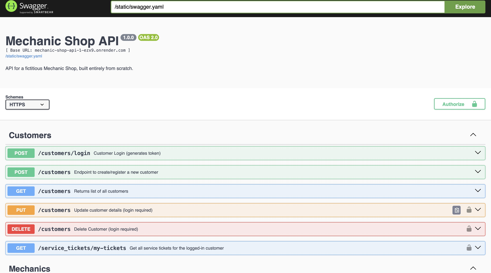
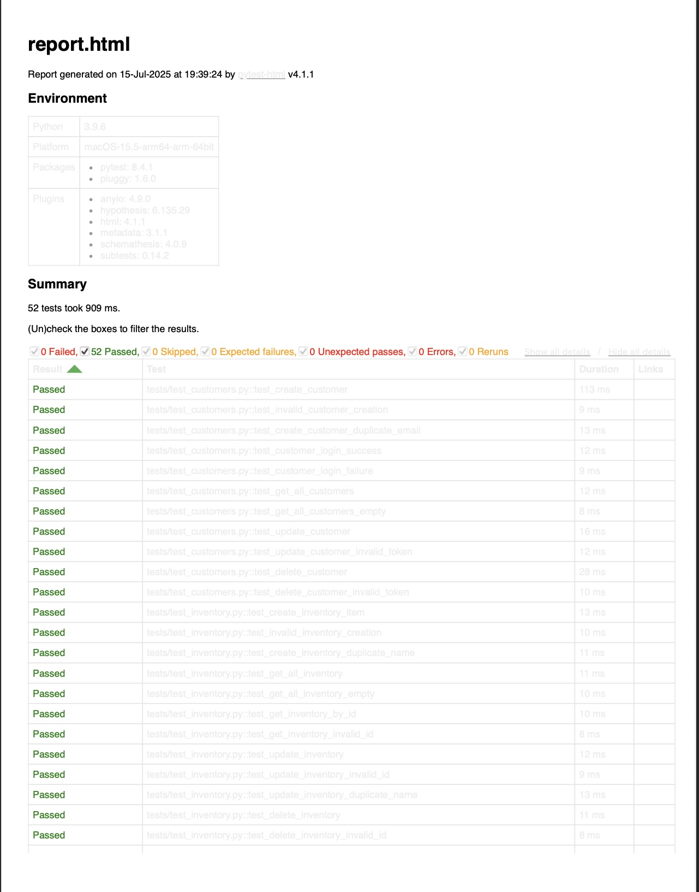
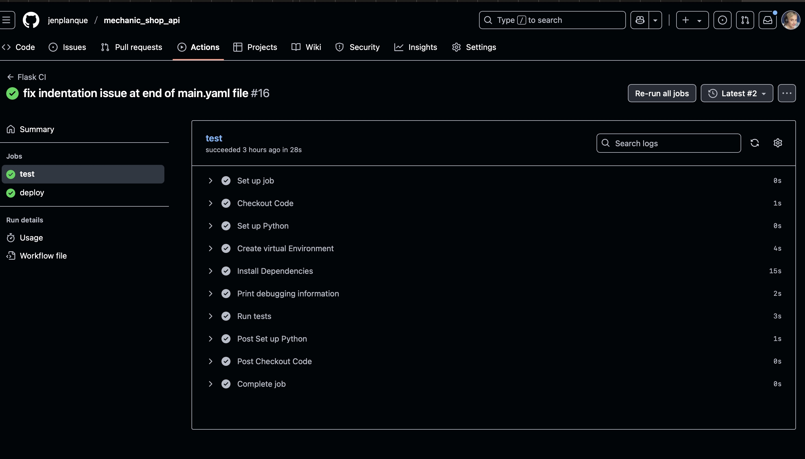

# 🧰 Mechanic Shop API

[](https://www.python.org/)
[](https://flask.palletsprojects.com/)
[](https://www.sqlalchemy.org/)
[](https://swagger.io/tools/swagger-ui/)
[](https://www.postman.com/)
[](https://render.com/)

#

**A comprehensive RESTful API for managing a mechanic shop's operations, including customers, mechanics, service tickets, and inventory management.**

---

## Author

**Jen Planque**  
_Software Development Graduate | Backend Specialization_  
GitHub: [@jenplanque](https://github.com/jenplanque)

---

## Table of Contents

1. [Author](#author)
2. [Introduction](#introduction)
3. [Tech Stack](#-tech-stack)
4. [Features](#features)
5. [Project Structure](#project-structure)
6. [Prerequisites](#prerequisites)
7. [Installation](#installation)
8. [Usage](#usage)
9. [API Documentation](#api-documentation)
10. [Testing](#testing)
11. [Deployment](#deployment)
12. [CI/CD Pipeline](#cicd-pipeline)
13. [Screenshots](#screenshots)
14. [Collaborators](#collaborators)
15. [Acknowledgments](#acknowledgments)

---

## Introduction

This Mechanic Shop API is my **final capstone project** for the Software Development Backend Specialization program at [Coding Temple](www.codingtemple.com). The project was developed in four comprehensive phases:

1. **Foundation & Documentation**: Core API development with Flask-Swagger documentation
2. **Advanced Features**: Rate limiting, caching, token authentication and advanced queries
3. **Resource Expansion**: Inventory management with many-to-many relationships
4. **Deployment & CI/CD**: Production deployment on Render with automated testing pipeline

The API provides complete CRUD operations for managing a Mechanic Shop's daily operations, featuring secure authentication, comprehensive testing and production-ready deployment with continuous integration.

### Project Philosophy

As someone with ADHD, I pivoted from the built-in [unittest](https://docs.python.org/3/library/unittest.html) to [pytest](https://docs.pytest.org/en/stable/) during development to leverage its visual, color-coded feedback system. This choice significantly improved my ability to identify patterns and debug tests effectively while maintaining full compatibility with unittest concepts and meeting all learning objectives.

---

## 📦 Tech Stack

| Feature         | Technology / Tool                          |
| --------------- | ------------------------------------------ |
| Language        | Python 3.11                                |
| Framework       | Flask 3.1.1                                |
| ORM             | Flask-SQLAlchemy 3.1.1, SQLAlchemy 2.0.41  |
| Database        | PostgreSQL (Production), SQLite (Dev/Test) |
| Adapter         | pg8000 1.31.2                              |
| Auth & Security | JWT (python-jose), Werkzeug, Flask-Limiter |
| Caching         | Flask-Caching, Redis 6.2.0                 |
| Documentation   | Swagger (flask-swagger), Swagger-UI        |
| Testing         | Pytest, pytest-html, Hypothesis, Postman   |
| Deployment      | Gunicorn, Render                           |
| CI/CD           | GitHub Actions                             |

---

## Features

### 🔐 **Authentication & Security**

- JWT token-based authentication for customers
- Secure password hashing with Werkzeug
- Token-protected routes for sensitive operations
- Rate limiting to prevent API abuse

### 👥 **Customer Management**

- Customer registration and login
- Profile management (view, update, delete)
- Secure token generation for session management
- Customer-specific service ticket access

### 🔧 **Mechanic Operations**

- Mechanic profile management
- Advanced queries: mechanics ranked by ticket completion
- Search functionality for finding mechanics
- Many-to-many relationships with service tickets

### 🎫 **Service Ticket System**

- Complete CRUD operations for service tickets
- VIN-based vehicle tracking
- Dynamic mechanic assignment/removal
- Customer-specific ticket retrieval with authentication
- Status tracking and updates

### 📦 **Inventory Management**

- Parts inventory with pricing
- Many-to-many relationships with service tickets
- CRUD operations for inventory items
- Inventory assignment to service tickets

### ⚡ **Performance Features**

- Flask-Caching for improved response times
- Pagination for large datasets
- Optimized database queries with SQLAlchemy 2.0
- Connection pooling for database efficiency

### 📊 **Advanced Queries**

- Mechanics ranked by service ticket completion
- Customer service history
- Inventory usage tracking
- Comprehensive filtering and search capabilities

---

## Project Structure

```
Mechanic_Shop/
├── .github/
│   └── workflows/
│       └── main.yaml              # CI/CD pipeline configuration
├── app/
│   ├── blueprints/                # API route modules
│   │   ├── customers/             # Customer management endpoints
│   │   ├── mechanics/             # Mechanic management endpoints
│   │   ├── service_tickets/       # Service ticket operations
│   │   └── inventory/             # Inventory management
│   ├── static/
│   │   └── swagger.yaml           # API documentation
│   ├── utils/
│   │   └── util.py               # Authentication utilities
│   ├── __init__.py               # Flask app factory
│   ├── extensions.py             # Flask extensions setup
│   └── models.py                 # Database models
├── tests/                        # Comprehensive test suite
│   ├── test_customers.py
│   ├── test_mechanics.py
│   ├── test_service_tickets.py
│   ├── test_inventory.py
│   └── test_validation.py
├── instance/                     # Database files
├── config.py                     # Environment configurations
├── flask_app.py                  # Production entry point
├── requirements.txt              # Python dependencies
├── pytest.ini                   # Test configuration
└── README.md                     # Project documentation
```

---

## Prerequisites

- **Python 3.9+** (Tested with Python 3.12)
- **pip** (Python package manager)
- **Git** (for cloning the repository)
- **PostgreSQL** (for production deployment)

---

## Installation

### 1. Clone the Repository

```bash
git clone https://github.com/jenplanque/mechanic_shop_api.git
cd mechanic_shop_api
```

### 2. Create Virtual Environment

```bash
python -m venv venv

# Activate virtual environment
# On macOS/Linux:
source venv/bin/activate
# On Windows:
venv\Scripts\activate
```

### 3. Install Dependencies

```bash
pip install --upgrade pip
pip install -r requirements.txt
```

### 4. Environment Configuration

Create a `.env` file in the root directory:

```env
FLASK_APP=flask_app.py
FLASK_ENV=development
SECRET_KEY=your-secret-key-here
DB_PW=your-database-password
DATABASE_URL=your-database-url (for production)
```

### 5. Database Setup

```bash
# Initialize the database
python -c "from app import create_app; from app.models import db; app = create_app('DevelopmentConfig'); app.app_context().push(); db.create_all()"
```

---

## Usage

### Development Server

```bash
python run.py
```

The API will be available at `http://localhost:5000`

### Production Server

```bash
gunicorn flask_app:app
```

---

## API Documentation

[Navigate to interactive Swagger documentation](https://mechanic-shop-api-1-ezx9.onrender.com/api/docs)

The API is fully documented using **Swagger/OpenAPI 2.0** specification. Each endpoint includes:

- **Path & Method**: GET, POST, PUT, DELETE operations
- **Tags**: Organized by resource (Customers, Mechanics, Service Tickets, Inventory)
- **Summary & Description**: Clear endpoint documentation
- **Parameters**: Required and optional parameters with validation
- **Security**: Token authentication requirements
- **Response Examples**: Sample responses with status codes

### Key Endpoints:

| Resource        | Method | Endpoint                          | Description                           |
| --------------- | ------ | --------------------------------- | ------------------------------------- |
| Customers       | POST   | `/customers`                      | Register new customer                 |
| Customers       | POST   | `/customers/login`                | Customer authentication               |
| Customers       | GET    | `/customers/my-tickets`           | Get customer's service tickets (Auth) |
| Mechanics       | GET    | `/mechanics`                      | List all mechanics                    |
| Mechanics       | GET    | `/mechanics/usage`                | Mechanics ranked by tickets completed |
| Service Tickets | GET    | `/service_tickets`                | List all service tickets              |
| Service Tickets | PUT    | `/service_tickets/<id>/edit`      | Update mechanics on ticket            |
| Inventory       | GET    | `/inventory`                      | List inventory items                  |
| Inventory       | POST   | `/service_tickets/<id>/inventory` | Add parts to service ticket           |

---

## Testing

The project includes comprehensive testing using **pytest** with 52 test cases covering:

#### Test Coverage:

- ✅ **Customer Operations**: Registration, login, CRUD operations
- ✅ **Mechanic Management**: Creation, updates, search functionality
- ✅ **Service Tickets**: Full lifecycle testing with authentication
- ✅ **Inventory Management**: CRUD operations and ticket integration
- ✅ **Authentication**: Token generation and validation
- ✅ **Error Handling**: Invalid inputs and edge cases
- ✅ **Advanced Queries**: Pagination, search, and ranking

---

### Running Tests

```bash
# Run all tests
pytest tests/ -v

# Run with HTML report
pytest tests/ --html=report.html

# Run specific test file
pytest tests/test_customers.py -v

# Run with coverage
pytest tests/ --cov=app
```

### Test Configuration

The project uses `TestingConfig` with in-memory SQLite database for isolated, fast testing:

```python
class TestingConfig:
    SQLALCHEMY_DATABASE_URI = "sqlite:///:memory:"
    TESTING = True
    DEBUG = True
```

---

## Deployment

### Production Deployment on Render

The API is deployed on **Render** with the following configuration:

#### 1. Database Setup

- PostgreSQL database hosted on Render
- Automatic `DATABASE_URL` environment variable
- Connection pooling for optimal performance

#### 2. Environment Variables

```env
DATABASE_URL=postgresql://...  # Automatically provided by Render
SECRET_KEY=production-secret-key
FLASK_ENV=production
```

#### 3. Production Configuration

The `ProductionConfig` class handles:

- PostgreSQL URL transformation for pg8000 compatibility
- Runtime database URI resolution
- Production-optimized caching and security settings

#### 4. Web Service Configuration

```yaml
# render.yaml (conceptual)
services:
  - type: web
    name: mechanic-shop-api
    env: python
    buildCommand: pip install -r requirements.txt
    startCommand: gunicorn flask_app:app
    envVars:
      - key: SECRET_KEY
        value: your-production-secret
```

**Live API**: [https://mechanic-shop-api-1-ezx9.onrender.com](https://mechanic-shop-api-1-ezx9.onrender.com)  
**API Documentation**: [https://mechanic-shop-api-1-ezx9.onrender.com/api/docs](https://mechanic-shop-api-1-ezx9.onrender.com/api/docs)

---

## CI/CD Pipeline

### GitHub Actions Workflow

The project includes a comprehensive [CI/CD pipeline](github/workflows/main.yaml) with:

#### 1. **Test Job**

- Python 3.12 environment setup
- Dependency installation from requirements.txt
- Pytest execution with verbose output
- Test failure prevention of deployment

#### 2. **Deploy Job** (depends on test success)

- Automatic deployment to Render
- Secure API key management via GitHub Secrets
- Production environment activation

#### 3. **Pipeline Features**

- **Trigger**: Automatic on push to `main` branch
- **Testing**: All 52 tests must pass before deployment
- **Security**: Encrypted secrets for deployment credentials
- **Reliability**: Deployment only occurs after successful testing

#### 4. **GitHub Secrets Configuration**

```
SERVICE_ID: srv-xxxxxxxxxxxxxxxxxxxxx (Render Service ID)
RENDER_API_KEY: rnd_xxxxxxxxxxxxxxxx (Render API Key)
```

---

### Workflow Execution

```yaml
name: Flask CI
on:
  push:
    branches: [main, master]
jobs:
  test: # Run comprehensive test suite
  deploy: # Deploy to Render (only if tests pass)
    needs: test
```

---

## Screenshots

### 📋 **API Documentation Interface**



### 🧪 **Test Results Dashboard**



### 🚀 **GitHub Actions Pipeline**



---

## Collaborators

This project was developed independently as a capstone project. However, special thanks to:

- **Coding Temple Staff** - Technical Support & Code Reviews
- **Pytest Community** - For creating an accessible testing framework that supports neurodiverse learning styles

---

## Acknowledgments

### Learning Journey

This project represents the culmination of intensive backend development study, showcasing:

- **RESTful API Design Principles**
- **Test-Driven Development (TDD)**
- **Production Deployment Strategies**
- **CI/CD Pipeline Implementation**
- **Database Design & Optimization**

### Accessibility Considerations

Special recognition for choosing **pytest over unittest** to accommodate ADHD learning needs:

- Visual, color-coded test feedback
- Enhanced readability and debugging capabilities
- HTML report generation for pattern recognition
- Maintained full compatibility with unittest principles

### Technical Growth

From initial Flask routes to production deployment with automated testing - this project demonstrates:

- ✅ **Professional Development Practices**
- ✅ **Comprehensive Testing Strategies**
- ✅ **Security Implementation**
- ✅ **Performance Optimization**
- ✅ **Documentation Excellence**
- ✅ **Deployment Automation**

---

**🔗 Repository**: [https://github.com/jenplanque/mechanic_shop_api](https://github.com/jenplanque/mechanic_shop_api)  
**🌐 Live API**: [https://mechanic-shop-api-1-ezx9.onrender.com](https://mechanic-shop-api-1-ezx9.onrender.com)  
**📚 Documentation**: [https://mechanic-shop-api-1-ezx9.onrender.com/api/docs](https://mechanic-shop-api-1-ezx9.onrender.com/api/docs)

---

_Built with ❤️ and ☕ by Jen Planque | Final Capstone Project 2025_
